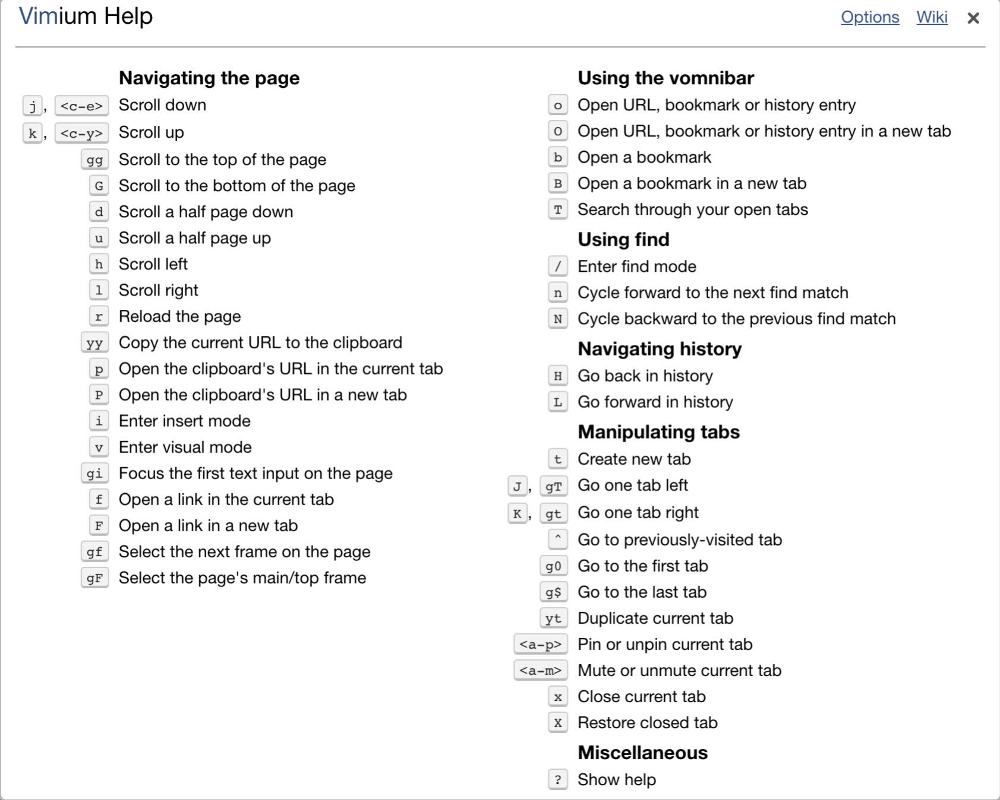

## Vimium

1、简介

Vimium 这个名字其实是 Vim 和 Chromium 的合体。Vimium 则继承了 Vim 中的常用键位，让你在使用 Chrome 的过程中，无论是浏览网页、切换标签或是其它任何操作，全都可以只通过键盘完成。

2、安装

通过在chrome应用商店中搜索并安装即可。

> github项目链接：[vimium](https://github.com/philc/vimium)，可以看到该项目还很活跃。

3、快捷键预览

可以在网页上按符号「?」来查看 Vimium 的所有快捷键列表：



## 常用快捷键总结

### 0、帮助

`?`  显示帮助对话框以获取所有可用键的列表

### 1、页面滚动

**方向操作**

「k」：向 `↑` 滚动一点

「j」：向 `↓` 滚动一点

「h」：向 `←` 滚动一点

「l」：向 `→` 滚动一点

「gg」：到页面最顶端

「G」：到页面最底部

> 和vim里快捷键一致

**滚屏**

- d：向 `↓` 滚动半屏
- u：向 `↑` 滚动半屏

### 2、打开当前页面上任意一个超链接

页面上不论有多少链接，不用鼠标点击，最多只需要敲三下键盘，就可以迅速打开任意一个链接。

操作步骤

- 按一下「f」（在当前页面打开，在新窗口中打开链接按大写的「F」），此刻当前页面上所有可点击的元素，都会生成一个对应的快捷键分派给这些链接，如下图所示：


- 如果想点击导航栏上的「专题」，只需要再输入「GJ」即可打开了「专题」页面。

### 3、标签页操作

- **显示当前所有的标签页，并快速切换**

痛点：有时候在查找信息、翻阅资料时，经常会一口气打开几十个网站，东西一多，Chrome 会自动将每个标签页的宽度缩小，几乎就看不到它们的标题了。

有了vimium插件，只需要按一下大写的「T」，就可以显示当前打开的所有标签页，并支持快捷搜索和跳转。

- **新建标签页**

按一下小写的「t」，就可以新建新的标签页了。

- **上一个标签页**

按下字符「^」，就可以快速切换到上一个标签页了。

- **左右标签**

选择左标签，按大写字符「J」，右标签按大写字符「K」（小写的该字符分别对应该页面内左右移动）。

- 首尾标签

「g0」—— 跳到第一个标签

「g$」—— 跳到最后一个标签

- **关闭/恢复标签**

关闭标签 —— 小写字符「x」

恢复标签 —— 大写字符「X」

- **将标签页移到新窗口**

大写字符「W」

### 4、搜索复制的内容

在网页上看到某个词和某句话，需要搜索一下，或某个链接点击不了，正常的操作步骤是：先复制，然后新建标签页，再粘贴，最后敲回车。

现在只需要两步：把要打开的文字/链接复制一下，直接按「p」或「P」就可以打开了，小写的 p 是在当前标签页打开，大写的 P 则新建标签页打开。 

### 5、刷新

小写的「r」

### 6、查找书签和历史记录

**查找书签**

- 在当前窗口打开 —— 小写的「b」
- 在新窗口中打开 —— 大写的「B」

**查找历史记录+书签**

- 在当前窗口打开 —— 小写的「o」
- 在新窗口中打开 —— 大写的「O」

### 7、将光标定位在输入框

将光标定位在第一个输入框 —— 先后输入小写字符「gi」

将光标定位在第二个输入框 —— 先后输入数字和小写字符「2gi」

### 8、编辑当前页面链接

编辑后的链接在当前页面打开 —— 先后输入小写字符「ge」

编辑后的链接在新页面打开 —— 先后输入小写字符和大写字符「gE」

### 9、搜索当前页面

在页面下输入 `/` 进入搜索模式，输入想要搜索的关键字，然后按回车

`n` 跳转到下一个搜索结果

`N` 跳转到上一个搜索结果

> 和vim里搜索使用姿势一致

### 10、当前页历史链接跳转

`H` 跳转到当前页的前一个链接，等同于chrome浏览器左上角的 `<-`

`L` 跳转到当前页的后一个链接，等同于chrome浏览器左上角的 `->`

### 11、标记

```text
ma      设置本地标记 a
`a      跳转到本地标记 a
``      跳回到跳转之前的位置 (也就是说，在执行gg，G，n，N，或/ a 之前的位置）
```

### 12、复制相关操作

`yy` 将当前网址复制到剪贴板

`gs` 查看源码

`v` 进入预览模式

`V` 进入预览行模式

注：在预览模式下，使用 `y` 拷贝，`p` 粘贴