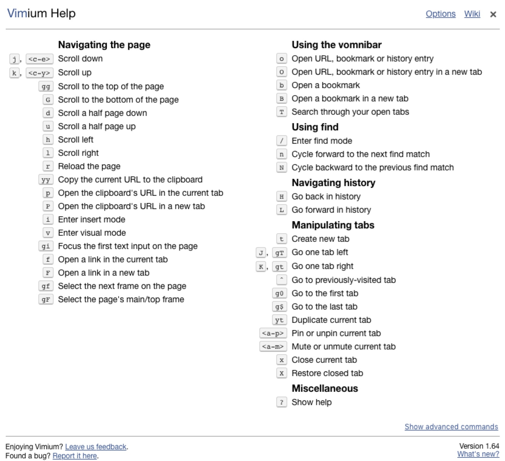

## Vimium

Vimium 这个名字其实是 Vim 和 Chromium 的合体。Vimium 则继承了 Vim 中的常用键位，让你在使用 Chrome 的过程中，无论是浏览网页、切换标签或是其它任何操作，全都可以只通过键盘完成。

项目链接：[vimium](https://github.com/philc/vimium)，可通过在chrome应用商店中搜索并安装。

可以在网页上按符号「?」来查看 Vimium 的所有快捷键列表：

## 常用快捷键总结

### 1、页面滚动

- j：向下滚动一点
- k：向上滚动一点
- gg：到页面最底部
- G：到页面最底部
- d：向下翻一屏
- u：向上翻一屏

### 2、打开新页面

- **复制一段链接：**经常在网页上看到一段链接文字，但却是不可点的。原来你需要先复制，然后新建标签页，再粘贴，敲回车后才能打开。现在呢？你只需要把要打开的链接复制一下，直接按「p」或「P」就可以打开了，小写的 p 是在当前标签页打开，大写的 P 则新建标签页打开。 
- **从收藏夹、历史记录打开：**是不是之前看过什么网页，现在又想看了，还需要再打开历史记录找？或者想打开收藏夹里的某个链接？现在，直接按下「o」，输入对应的关键字后，会一起搜索你的历史记录和收藏夹，如果你输的是一个网址，回车还能直接打开。

### 3、打开当前页面上任意一个连接

任意一个页面上，哪所有再多链接，你也不用鼠标，最多只需要敲三个键，你就可以迅速打开任意一个链接。

如下图所示，只需要按一下「f」，然后当前页面上所有可点击的元素，都会生成一个对应的快捷键分派给这些链接。比如我现在想点击导航栏上的「专题」，只需要再输入「GJ」，OK！完成了，你只敲了三个键，就打开了「专题」页面。

如果想要在新窗口中打开链接，将小写的「f」换成大写的「F」。

### 4、标签页操作

- **显示当前所有的标签页，并快速切换**

有时候在查找信息、翻阅资料时，经常会一口气打开几十个网站，东西一多，Chrome 会自动将每个标签页的宽度缩小，几乎就看不到它们的标题了。

 在Vimium中，按一下大写的「T」，就可以显示当前打开的所有标签页，并支持快捷搜索和跳转。

- **新建标签页**

按一下小写的「t」，就可以新建新的标签页了。

- **上一个标签页**

按下字符「^」，就可以快速切换到上一个标签页了。

- **左右标签**

选择左标签，按大写字符「J」，右标签按大写字符「K」（小写的该字符分别对应该页面内左右移动）。

- **关闭/恢复标签**

关闭标签 —— 小写字符「x」

恢复标签 —— 大写字符「X」

- **将标签页移到新窗口**

大写字符「W」

### 5、刷新

小写的「r」

### 6、查找书签和历史记录

**查找书签**

- 在当前窗口打开 —— 小写的「b」
- 在新窗口中打开 —— 大写的「B」

**查找历史记录+书签**

- 在当前窗口打开 —— 小写的「o」
- 在新窗口中打开 —— 大写的「O」

### 7、将光标定位在输入框

将光标定位在第一个输入框 —— 先后输入小写字符「gi」

将光标定位在第二个输入框 —— 先后输入数字和小写字符「2gi」

### 8、编辑当前页面链接

编辑后的链接在当前页面打开 —— 先后输入小写字符「ge」

编辑后的链接在新页面打开 —— 先后输入小写字符和大写字符「gE」

> 9、TODO
>
> 更多常用且方便的快捷挖掘中……

